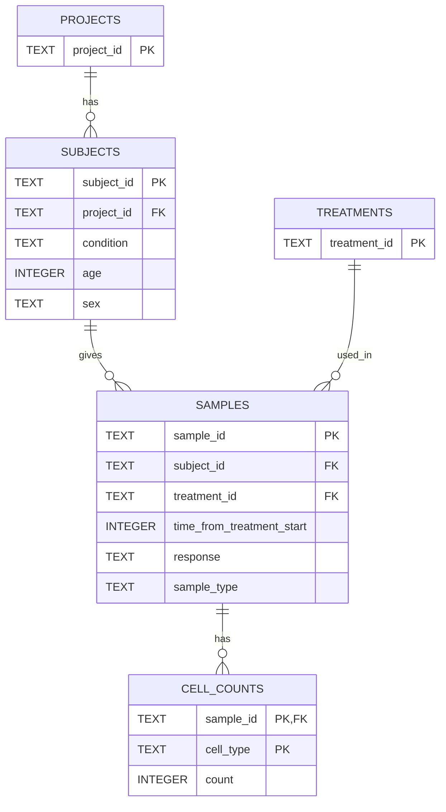

# loblaw-bio

A scalable project consisting of a fully-functional relational database w/ normalized schema & accompanying Streamlit-based front-end containing dynamically-updated and queried data visualizations and CRUD-enabled tables for a technical assessment.

## Running this Locally

You can access a live version of the front-end linked here (hosted on Streamlit Community Cloud).

But if you'd like to run the code yourself, you'll need a few...

### Dependencies

* [matplotlib](https://matplotlib.org/)
* [numpy](https://numpy.org)
* [pandas](https://pandas.pydata.org/)
* [scipy](https://scipy.org/)
* [seaborn](https://seaborn.pydata.org/)
* [streamlit](https://streamlit.io/)
* [streamlit-aggrid](https://www.ag-grid.com/)

These are also found in `requirements.txt`. Then, you'll want to...

### Setup

1. Clone the repo
2. (Optional) Create a virtual environment
3. Run `pip install -r requirements.txt`
4. Run `python scripts/load_data.py` to create & preload the database
5. Start the app with `streamlit run app/app.py`

Note that the app runs at `http://localhost:8501` by default.

## Database Schema

This database is designed with scalability in mind. From `cell-count.csv`, we s several unique entities worth pulling out into their own tables, which can all be joined to create the original file provided.

* Projects - grouping subjects under studies
* Subjects - people who are being studied
* Treatments - treatments given to samples
* Samples - samples taken from subjects
* Cell Counts - flexibly holds cell counts for samples

While for such a small amount of data it may be trivial to include Treatment/Project as simple columns of Samples/Subjects, in future if there are additional data for either Treatments/Projects, it will be more scalable to modify those tables (which as of now just store IDs).

Initially, I planned on including cell count data (e.g. b_cell, monocyte, etc.) in the Samples table. This works fine as a proof-of-concept. However, if the number of cells we plan on testing for in each sample changes (to be all-encompassing, as is Teiko's goal), it becomes unwieldy to add a new column each time we expand our scope. Instead, we should split those into a separate table Cell Counts, wherein we can simply add a number and a cell type while referring to the sample. So regardless of however many new cell types we are looking to count, we can add them all to the Cell Counts table.

(Note: This is my first time using `mermaid` to render Entity Relationship diagrams, so I'm not certain on the compatibility across browsers -- sorry if it doesn't work!. I've included a screenshot for redundancy's sake, too.)

## Code Overview

I've written this code to be as modular and scalable as possible within the time constraints.

* `app/` - this directory holds `app.py`, the Streamlit script responsible for the front-end. Future pages can be added here.
  * `app.py` provides interactive/filterable tables, CRUD functionality, data visualizations, and dynamic analyses that adjust to what data is currently displayed.
* `data/` - the initial `cell-count.csv` as well as the SQLite database are stored here.
* `docs/` - files that enable Github Pages functionality.
* `scripts/`
  * `load_data.py` initializes and loads the database with information from the given csv. It can also be called to reload the database on the front-end.
  * `utils.py` contains utility functions that aid in connecting to/querying the database.

Each entity (table) has its own mass delete/add entry functionality on their own page in the Streamlit app. This is achieved modularly with the `PAGE_CONFIG` dictionary, minimizing repeated code and allowing the website to dynamically update without taking the user to different webpages.

Data visualization is dynamic and achieves listed goals:

* a relative frequency summary table is presented,
* a boxplot visualizing differences in cell populations dynamically updates with new/filtered data,
* and Mann-Whitney U analysis is similarly dynamically run on data to provide statistical rigor.

Extending this project for new tables and new analysis questions would be as simple as adding new dictionaries to the `PAGE_CONFIG` in/functions to `app.py`. Should new cell populations be measured, no additional work needs to be done on the backend database, and the `CELL_TYPES` list can simply be amended in `utils.py`.
