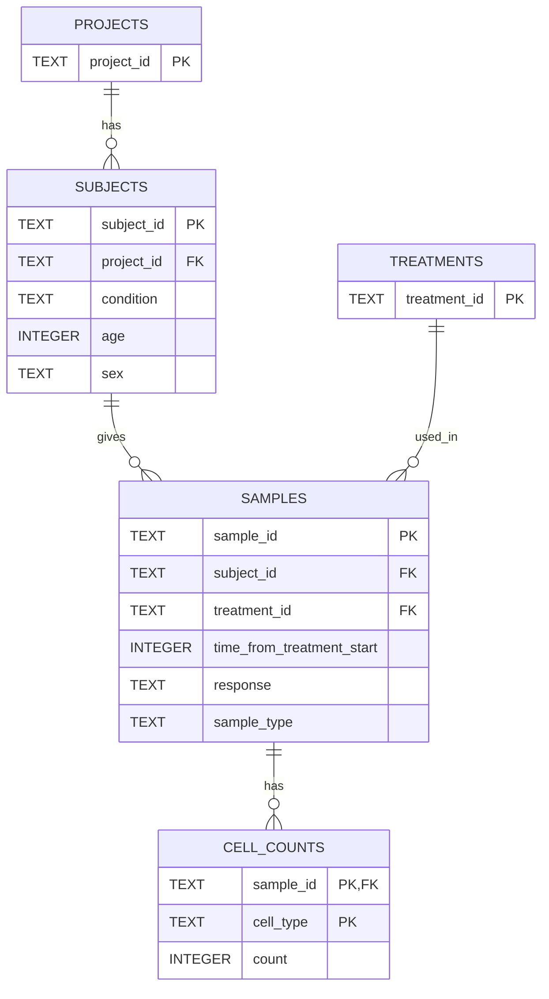

# loblaw-bio

A README.md with:

* [ ] Any instructions needed to run your code and reproduce the outputs.
* [X] An explanation of the schema used for the relational database, with rationale for the design and how this would scale if there were hundreds of projects, thousands of samples and various types of analytics you’d want to perform.

* [ ] A brief overview of your code structure and an explanation of why you designed it the way you did.

## Schema Explanation

Extrapolating from the provided `cell-count.csv`, we have several unique entities worth pulling out into their own tables, which can all be joined to create the original file provided.

* Projects
* Subjects
* Treatments
* Samples
* Cell Counts

While for such a small amount of data it may be trivial to include Treatment/Project as simple columns of Samples/Subjects, in future if there is additional data for either Treatments/Projects it will be more scalable to modify those tables (which as of now are currently extremely simple, just storing IDs).

Initially, I planned on including cell count data (e.g. b_cell, monocyte, etc.) in the Samples table. This works fine as a proof-of-concept. However, if the number of cells we plan on testing for in each sample changes (to be all-encompassing, as is Teiko's goal), it becomes unwieldy to add a new column each time we expand our scope. Instead, we should split those into a separate table Cell Counts, wherein we can simply add a number and a cell type while referring to the sample. So regardless of however many new cell types we are looking to count, we can add them all to the Cell Counts table.

(Note: This is my first time using `mermaid` to render Entity Relationship Diagrams, so I'm not certain on the compatibility across browsers. If it doesn't work, please contact me!)

