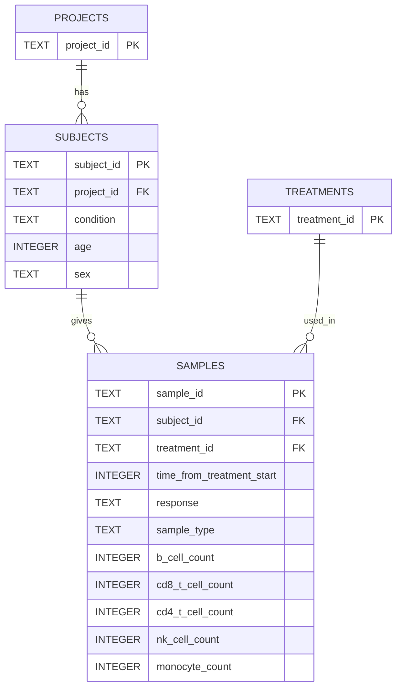

# loblaw-bio

A README.md with:

Any instructions needed to run your code and reproduce the outputs.

An explanation of the schema used for the relational database, with rationale for the design and how this would scale if there were hundreds of projects, thousands of samples and various types of analytics you’d want to perform.

A brief overview of your code structure and an explanation of why you designed it the way you did.

## Schema Explanation

Extrapolating from the provided `cell-count.csv`, we have several unique entities worth pulling out into their own tables, which can all be joined to create the original file provided. While for such a small amount of data it may be trivial to include Treatment/Project as simple columns of Samples/Subjects, in future if there is additional data for either Treatments/Projects it will be more scalable to modify those tables (which as of now are currently extremely simple, just storing IDs).

* Projects
* Subjects
* Treatments
* Samples

